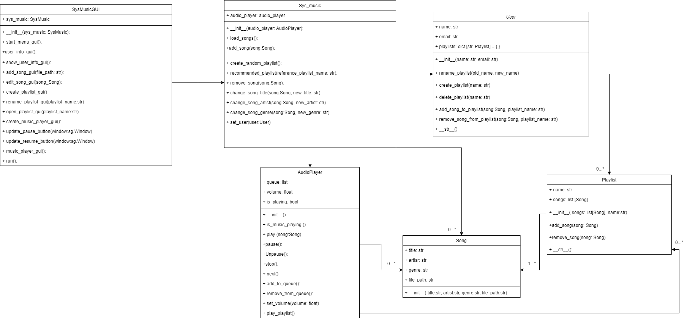

# AUTORES

- Tomás Córdoba Urquijo
- Paula Meneses
- Daniel Correa

# SISTEMA DE MÚSICA

Este proyecto es un reproductor de audio que personaliza la experiencia musical del usuario, ofreciendo funcionalidades 
que se adapten a sus gustos y preferencias.

# MODELO DE MUNDO 
El **modelo del mundo** para el sistema de música es el siguiente:

## FUNCIONALIDADES

- Añadir una canción al sistema de música.
- Eliminar una canción del sistema de música.
- Proporcionar la información de perfil del usuario.
- Reproducir una canción seleccionada.
- Pausar la canción que se está reproduciendo.
- Detener la canción que se está reproduciendo.
- Saltar a la siguiente canción en la cola o lista de reproducción.
- Editar los detalles de una canción en el sistema de música.
- Añadir una canción seleccionada a la cola de reproducción.
- Eliminar una canción seleccionada de la cola de reproducción.
- Crear una nueva lista de reproducción.
- Eliminar una lista de reproducción seleccionada.
- Abrir y ver las canciones en una lista de reproducción seleccionada.
- Renombrar una lista de reproducción seleccionada.
- Reproducir todas las canciones en una lista de reproducción seleccionada.
- Crear una lista de reproducción aleatoria.
- Recomendar una lista de reproducción basada en las preferencias musicales del usuario.

## CÓMO USAR

Para usar el sistema de música, se debe clonar el repositorio y ejecutar el archivo `app.py`

Se le presentará un menú de bienvenida para iniciar la aplicación. A partir de ahí, se le tomaran los datos de usuario y 
accederá al sistema de música.

## DEPENDENCIAS

Este proyecto hace uso de las siguientes librerías:

- `pygame`
- `PySimpleGUI`

Se encuentran en el archivo `requirements.txt`
